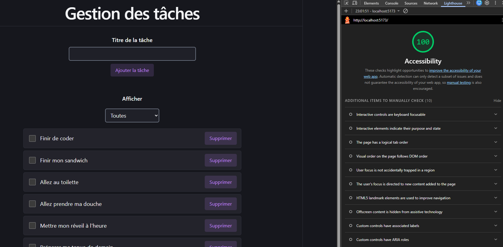
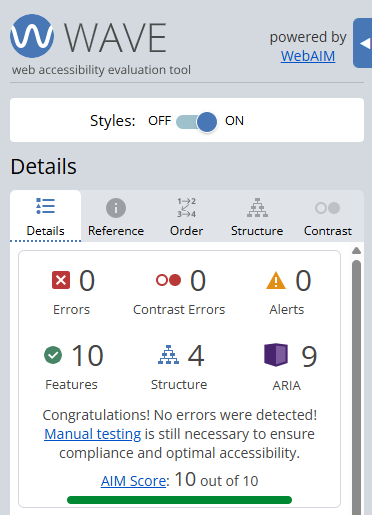
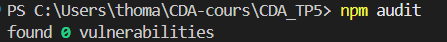

# Gestion des tâches : TP 5

Application de gestion de tâches pour une association comptant des bénévoles malvoyants.

- **API** : Node.js, Express, PostgreSQL (Docker Compose), à la racine du dépôt.
- **Interface** : React + Vite, dans le dossier `frontend`.

Chaque tâche a un titre, un statut (complétée ou non) et, facultativement, le **prénom** du bénévole qui s'en occupe.

---

## 1. Lancer le projet

### Prérequis

- Docker Desktop (démarré)
- Node.js 20 ou plus récent

### API et base de données

À la racine du dépôt :

```powershell
Copy-Item .env.example .env
```

Ouvrir `.env` et remplacer `changez-moi` par un mot de passe de votre choix, puis :

```powershell
docker compose up -d --build
```

L'API répond sur <http://localhost:3000/tasks>.

> PostgreSQL ne lit les identifiants et `db-init/init.sql` qu'à la création de la base. Après les avoir modifiés :
> `docker compose down -v` puis `docker compose up -d --build` (les données de test sont recréées).

### Interface

Dans le dossier `frontend` :

```powershell
Copy-Item .env.example .env
npm install
npm run dev
```

L'application tourne sur <http://localhost:5173>.

### Vérifications utiles

```powershell
npm run lint                       # dans frontend : aucune erreur
docker compose logs api            # aucun contenu de requête dans les logs
docker compose exec api whoami     # doit répondre : node
```

### Variables d'environnement

| Fichier | Variable | Rôle |
|---|---|---|
| `.env` (racine) | `DB_USER`, `DB_PASSWORD`, `DB_NAME` | Identifiants PostgreSQL, lus par Docker Compose |
| `frontend/.env` | `VITE_API_URL` | URL de l'API (seule variable du frontend) |

Les fichiers `.env` ne sont jamais commités. Les fichiers `.env.example` (racine et `frontend`) contiennent des valeurs fictives.

---

## 2. Structure du dépôt

```
.
├── db-init/init.sql        schéma et données fictives
├── frontend/               interface React + Vite
├── server.js               API Express
├── Dockerfile              image de l'API (utilisateur non-root)
├── docker-compose.yml      API + PostgreSQL
├── .env.example
└── README.md
```

## 3. Routes de l'API

| Méthode | Route | Rôle |
|---|---|---|
| GET | `/tasks` | Liste des tâches |
| GET | `/tasks?status=completed` ou `uncompleted` | Liste filtrée |
| POST | `/tasks` | Ajoute une tâche (`title` obligatoire, `assignee` facultatif) |
| PUT | `/tasks/:id` | Modifie `title`, `isCompleted` et/ou `assignee` |
| PATCH | `/tasks/:id/completed` | Inverse le statut |
| DELETE | `/tasks/:id/assignee` | Retire le prénom du bénévole sans supprimer la tâche |
| DELETE | `/tasks/:id` | Supprime la tâche (et donc son prénom) |

---

## 4. Accessibilité

Mesures mises en place : `lang="fr"` et titre de page explicite, structure sémantique (`header`, `main`, un seul `h1`, liste `ul`/`li`), labels visibles reliés aux champs, vrais boutons avec nom explicite, statut par case à cocher, focus clavier visible, messages `role="status"` (succès) et `role="alert"` (erreurs), erreurs de saisie reliées aux champs par `aria-describedby`, contrastes d'au moins 4,5:1. Le plugin `eslint-plugin-jsx-a11y` est actif : `npm run lint` ne signale aucune erreur.

### Lighthouse (Accessibilité)

Score : **100 / 100**



### WAVE

Aucune erreur signalée.



### Parcours au clavier

Ajouter, cocher, filtrer, retirer un bénévole et supprimer une tâche fonctionnent avec Tab, Entrée et Espace.

---

## 5. Sécurité

- **Secrets hors du code** : identifiants PostgreSQL dans un `.env` à la racine, lus par Docker Compose (y compris dans le `healthcheck`). Aucun `.env` n'est commité.
- **Aucun secret dans le frontend** : seule `VITE_API_URL` est utilisée.
- **CORS** : l'API n'accepte que l'origine du frontend (`CORS_ORIGIN`, par défaut `http://localhost:5173`), jamais `*`.
- **Validation** : le titre est contrôlé dans le formulaire (obligatoire, 255 caractères au plus) et par l'API avec Joi, qui contrôle aussi le prénom.
- **XSS** : les titres sont affichés par React comme du texte. Une tâche nommée `` s'affiche telle quelle, sans exécution. `dangerouslySetInnerHTML` n'est jamais utilisé.
- **Docker** : l'API tourne avec `USER node` (pas en root). Un `.dockerignore` évite de copier `.env` et `frontend` dans l'image.

### npm audit

| Dossier | Résultat |
|---|---|
| Racine (API) | `found 0 vulnerabilities` |
| `frontend` | `found 0 vulnerabilities` |



> Le dossier `frontend` contient un fichier `.npmrc` (`legacy-peer-deps=true`). `eslint-plugin-jsx-a11y` déclare encore une compatibilité jusqu'à ESLint 9, alors que le projet Vite utilise ESLint 10. Le plugin fonctionne correctement avec cette version.

---

## 6. RGPD : fiche du traitement

| Rubrique | Description |
|---|---|
| **Responsable du traitement** | L'association (contact : contact@association.example) |
| **Finalité** | Savoir quel bénévole s'occupe de chaque tâche |
| **Base légale** | Intérêt légitime de l'association à organiser ses activités |
| **Données collectées** | Uniquement le **prénom** du bénévole (facultatif, 50 caractères au plus, lettres uniquement). Ni nom de famille, ni e-mail, ni téléphone. |
| **Durée de conservation** | Tant que la tâche existe. Le prénom est supprimé en même temps que la tâche. |
| **Personnes ayant accès** | Les membres de l'association qui utilisent l'application et les administrateurs de la base de données. L'application n'a pas d'authentification : l'accès doit être limité au réseau de l'association. |
| **Destinataires** | Aucun tiers. Aucune donnée n'est transmise à un service externe. |
| **Traceurs** | Aucun (pas de statistiques, de publicité ni de script tiers) |
| **Journaux** | L'API n'écrit jamais le contenu des requêtes dans ses logs |
| **Droits des bénévoles** | Accès, rectification, effacement, opposition |
| **Exercer ses droits** | Par e-mail à contact@association.example. L'effacement peut aussi être fait directement dans l'application avec le bouton « Retirer le bénévole ». En cas de désaccord, une réclamation peut être déposée auprès de la CNIL (cnil.fr). |

Les données de départ de `init.sql` utilisent des prénoms **inventés** : aucune donnée réelle n'est présente dans le dépôt.

---

## 7. Questions

**Pourquoi aucune variable `VITE_` ne contient de secret ?**
Vite recopie toutes les variables qui commencent par `VITE_` en clair dans le JavaScript envoyé au navigateur. Ce code est téléchargé par chaque visiteur, qui peut le lire avec les outils de développement. Un mot de passe ou une clé placés dans une variable `VITE_` seraient donc publics. `VITE_API_URL` ne contient que l'URL de l'API, qui n'est pas secrète. Les identifiants PostgreSQL restent dans le `.env` de la racine, lu uniquement par Docker Compose et par l'API.

**Pourquoi la validation du frontend ne suffit pas ?**
Le contrôle du formulaire (titre obligatoire, 255 caractères au plus) guide l'utilisateur, mais il s'exécute dans le navigateur, que l'utilisateur maîtrise. Il peut être contourné en modifiant la page ou en appelant directement l'API (Bruno, `curl`, script). Seul le contrôle côté serveur, ici avec Joi, protège réellement les données : l'API refuse toute requête invalide, d'où qu'elle vienne.

**Pourquoi l'application n'a-t-elle pas besoin de bandeau cookies ?**
L'application n'utilise aucun cookie ni traceur : pas d'outil de statistiques, pas de pixel publicitaire, pas de script tiers. Un bandeau de consentement n'est requis que pour déposer ou lire des traceurs qui ne sont pas strictement nécessaires au service. Ici, il n'y en a aucun, donc rien à consentir.

---

## 8. Bonus : déploiement

| Service | URL |
|---|---|
| API (Fly.io) | _non déployé_ |
| Interface (Netlify) | _non déployé_ |